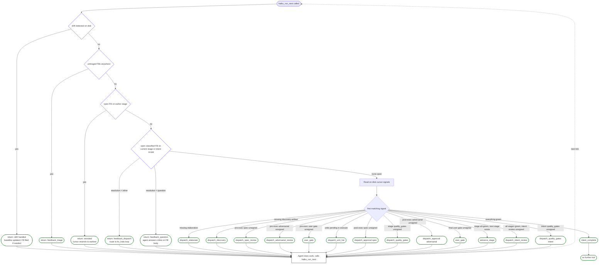

# H·AI·K·U Engine — The Goal

## What you are being asked to do

Align the entire system — `engine/workflow` (the orchestrator at `packages/haiku/src/orchestrator/workflow/`), the paper, the prototype, and the docs — to match this document, end to end, as **one goal**. This is a system-alignment effort, not just a test-writing effort. Every section, every diagram, every signal definition, every checkbox, every schema change, every sync-surface update is part of the same deliverable: **the engine/workflow actually behaves the way this doc describes, and every surface that documents it describes the same behavior.**

This is not a menu. Don't pick three items and call it shipped. The doc describes one coherent system with three pre-tick primitives, one feedback handler, one signal contract, and one terminal state. Partial implementation produces incoherent behavior — half-migrated engines have always-on bugs and confused agents.

### Definition of done

The single goal is complete when **all** of the following are true:

1. **The engine/workflow's runtime behavior matches every signal contract in this doc.** Drift, feedback, and external signal sync are the only pre-tick primitives. Cursor is signal-driven, first-match-wins, with the precedence list specified. Reviews stamp `reviews.*` (pre-exec) and `approvals.*` (post-exec). Quality gates run at three scopes (unit / stage / intent) with intent-scope derived from the union of unit gates. Gates by mode produce one approval stamp from one of four sources. FBs route by classification through one handler. The hat loop appends iterations forward-only. The intent seals at `intent_complete` and nothing ticks after.
2. **Schema cleanups are done.** `intent.quality_gates[]` and `intent_completion_review:` are removed. Unit FM has `reviews.<role>` distinct from `approvals.<role>`. The `closes:` field exists. FB origins include `discovery`. There is no `current_hat:` field anywhere; current hat is always derived from `iterations[]`. `state.json` is gone — do not reintroduce it.
3. **Studio configurations and stage definitions reflect the new flow.** Any studio that relied on `intent.quality_gates[]` declares an integration stage instead. Stages that depended on sequential elaborate → discovery → decompose are updated to the single elaborate loop with concurrent activities. Hat sequences include `decompose-verifier` where needed.
4. **Every test goal in this doc has a passing test.** Each checkbox in the goal sections has a real automated test in the suite. Tests assert on disk state after each tick, not on tool-call sequences. One test per handler with parameter variation, not one test per visual fix box.
5. **Sync surfaces match.** The paper (`website/content/papers/haiku-method.md`), the interactive architecture map (`website/app/studios/[slug]/architecture/`), the auto-generated workflow diagrams (`website/public/workflow-diagrams/<studio>.mmd`), and the docs (`website/content/docs/`) all describe the flow this doc describes. Terminology drift (HITL/OHOTL/AHOTL, legacy phase ordering, defunct verbs) is removed across all four surfaces.
6. **The flow diagram and per-tick decision tree in this doc render without error** and reflect the engine/workflow's actual behavior. Discrepancy between diagram and engine/workflow is a defect in whichever drifted from the spec — fix it.

### The doc is the source of truth for the alignment, not the engine/workflow

When the engine/workflow and this doc disagree, **the engine/workflow is wrong unless the doc is**. The point of the alignment effort is to bring the engine/workflow to the doc. If a contradiction surfaces, the resolution path is: confirm the doc reflects the desired design (with the human), then update the engine/workflow. The doc is the design intent; the engine/workflow is the implementation that should match it.

If the engine/workflow reveals a problem in the doc (an unimplementable contract, an internally inconsistent rule), fix the doc first — get alignment on the intended behavior — then implement.

### How to read the rest of the doc

The doc is layered. Read it in this order:

1. **Foundational principles** (under "Notes for test authors") — start here. The two pillars: *all we ever do is advance until the intent is sealed*, and *the engine is a small set of pre-tick primitives, not a state machine with eighty handlers*. If your work contradicts either pillar, your work is wrong.
2. **Signals catalog** — the contract. Every on-disk thing the engine reads or writes is in here. If a behavior in the engine isn't expressible as "read signal X, write signal Y," it's incidental and should be removed.
3. **Flow diagram + per-tick decision tree** — the runtime shape. The diagram shows lifecycle sequence; the per-tick tree shows what happens inside one `haiku_run_next`. Together they describe the full system.
4. **Lifecycle list (Full stage lifecycle)** — the prose version of the diagram. Useful as a checklist when verifying coverage.
5. **Elaborate-loop section** — the one place the current engine is wrong-by-design (sequential elaborate → discovery → decompose). Replace with the concurrent loop described in that section.
6. **Test author notes** — read before writing any tests, to avoid duplicating coverage across visually-distinct-but-mechanically-identical paths.
7. **Sync surfaces + the goal checkboxes** — the audit list. Use these to verify the work is actually complete before claiming it is.

End-to-end behaviors the system must demonstrate follow. Every checkbox is pass/fail against the tick contract: the **tick** decides what happens next based on on-disk signals, not on side-effect API verbs.

## Feedback

- [ ] **Feedback round-trip without loops.** An agent can leave feedback and address that feedback through the normal hat sequence without trapping the engine in a loop.
- [ ] **Unclassified feedback is triaged first.** When any open feedback lacks a classification, the very next tick action is feedback triage. No other handler dispatches until classification completes.
- [ ] **Classified feedback follows the right loop, decided by the tick.**
  - `question` → answered inline on the FB body.
  - `inline` → resolved inline without rewinding the cursor.
  - `revisit` → cursor rewinds to the earliest stage carrying the open FB.
  - The tick chooses the route. No API verb forces it.

## Drift

- [ ] **Drift detection fires before anything else.** When files are edited or added outside the engine and outside the agent's MCP tool surface, the pre-tick drift gate runs before any handler. It resolves drift internally (updates markers, baselines, etc.) and leaves feedback only when the agent genuinely needs to address something.

## Units

- [ ] **Hats advance cleanly to the final hat.** A unit progresses through its full hat sequence; the terminal `advance` flips the unit to complete and the next tick returns the correct downstream action (next unit, next phase, or stage close). No stuck states between hats.

## Feedback-as-unit fix loop

- [ ] **Same guarantees as units, applied to feedback.** FB-as-unit fix hats advance to the terminal hat without loops, and the closing advance flips the FB to closed with the correct next action.

## Intent scope

- [ ] **Intent-level feedback stays at intent scope.** Adversarial review at the intent level writes FBs at intent scope. The fix loop cycles intent-level fix hats. The cursor does not rewind to a stage when the finding belongs to the whole intent.
- [ ] **Intent completion review is universal — remove `intent_completion_review:` from the schema.** Every intent runs the studio's review-agents after the final stage gate. No opt-out flag on intent frontmatter. The only way a studio gets no completion review is by shipping zero review-agents in `studios/<studio>/review-agents/`. Drop the `Type.Optional(Type.Boolean())` field from `packages/haiku/src/state/schemas/intent.ts` and remove every guard that reads it in the orchestrator.
- [ ] **Intent-level quality gates are derived, not declared.** The intent-level QG re-run walks every stage's units, collects the union of all `unit.quality_gates[]`, dedupes by command, and runs each distinct command once against the integrated intent state. Same mechanism as stage QG re-run, just wider scope. **Remove the `intent.quality_gates[]` field from the schema.** The set is derived; the field is redundant and lets studios drift from the derive-from-units rule. Failures file FBs with `targets.invalidates: ["intent_quality_gates"]`; passes stamp `approvals.intent_quality_gates` at intent scope.

## Full stage lifecycle (single stage, every phase)

A single stage must traverse the entire sequence without manual intervention. **Every numbered step below is one or more `haiku_run_next` ticks. The "fix loop" steps are not separate phases — they're the feedback loop (pre-tick check #2) handling FBs that the prior step filed.** Drift sweep (pre-tick check #1) runs before every tick regardless of which step is active.

1. **Elaborate loop** — single cursor state, concurrent conversation + discovery + unit drafting. Loop continues until all four completion signals flip (see [Elaboration as a concurrent loop](#elaboration-as-a-concurrent-loop-not-three-sequential-phases)). Exit signal: `approvals.elaborate_complete` stamped.
2. **Pre-execution spec review** — `dispatch_approval` with spec-conformance prompt against each unit spec. Outputs: stamp `unit.reviews.spec` on pass, or file FBs.
3. **Feedback loop handles step 2's FBs** — pre-tick feedback flow routes `resolution: inline` FBs to `feedback_dispatch`, runs stage `fix_hats:` against each FB body. On close, `targets.invalidates: ["reviews.spec"]` clears the stamp; the next tick re-fires step 2.
4. **Pre-execution adversarial review** — `dispatch_approval` per configured adversarial agent against each unit spec. Outputs: stamp `unit.reviews.<agent>` per agent, or file FBs.
5. **Feedback loop handles step 4's FBs** — same mechanism as step 3, with `targets.invalidates: ["reviews.<agent>"]`.
6. **Pre-execution user review gate** — calls [Gate action](#gate-action). Outputs: `reviews.user_gate` stamped at stage scope, OR (out-of-band) user files an FB and advances.
7. **Feedback loop handles step 6's FBs** — user FBs route through classification; `resolution: inline` runs fix_hats, `resolution: revisit` rewinds to the earliest stage carrying the FB.
8. **Execution — hat loop per unit.** Units dispatch through their declared hat sequence. The terminal hat's `advance` stamp runs the unit's `quality_gates[]` inline as part of the stamp; on fail the stamp fails and returns a reject signal to the previous hat. **No unit merges to the stage branch until its quality_gates pass.**
9. **Post-execution spec approval** (agent — spec-conformance review against unit output). Outputs: stamp `unit.approvals.spec` per unit, or file FBs.
10. **Feedback loop handles step 9's FBs** — `targets.invalidates: ["approvals.spec"]`.
11. **Stage quality-gate re-run** — loops every unit's `quality_gates[]`, dedupes on identical commands, runs once per distinct command against the integrated stage branch. Canonical post-execute role order: spec → quality_gates → review. Outputs: stamp `unit.approvals.quality_gates` per unit on pass, or file FBs with `targets.invalidates: ["approvals.quality_gates"]`.
12. **Feedback loop handles step 11's FBs** — same mechanism.
13. **Post-execution adversarial review** — `dispatch_approval` per configured adversarial agent against unit output. Outputs: stamp `unit.approvals.<agent>` per agent.
14. **Feedback loop handles step 13's FBs** — `targets.invalidates: ["approvals.<agent>"]`.
15. **Post-execution final user approval gate** — calls [Gate action](#gate-action).
16. **Feedback loop handles step 15's FBs** — same mechanism as step 7.
17. **Stage complete** — `approvals.user_gate` stamped at stage scope, cursor advances to next stage or to intent-level review.

After all stages complete: intent-level review (one shot through studio review-agents — always fires, no opt-out), intent-level quality-gate re-run (walk every stage, union all `unit.quality_gates[]`, dedupe by command, run once at intent scope — derived, not declared), then intent completion seals the intent. Each of these can produce FBs handled by the same feedback loop, with `targets.invalidates:` clearing the relevant intent-scope approval stamps.

**The pattern is the same at every step.** Reviews stamp on pass or file FBs on findings. The feedback loop handles the FBs. On close, `targets.invalidates:` clears the right stamps and the review re-fires. The only thing varying step-to-step is the `origin:` on the FB and which stamp is invalidated.

## Notes for test authors — don't confuse visual sequence with handler count

The diagrams in this doc render the **lifecycle sequence** the engine moves through. They are not a handler topology. Several boxes that look distinct are the same handler rendered multiple times because the sequence reaches it multiple times. Tests should target handlers, not boxes. Read the rules below before writing test cases.

### Foundational principle: all we ever do is advance, until the intent is sealed

The engine has no concept of reject, undo, rollback, or branch-back. Every action is forward motion — until the intent is sealed at `intent_complete`, after which no further ticks fire. Even the things that look like reverses are advances against new signals:

- **"Revisit"** isn't a rewind — it's the cursor advancing into a corrective elaborate phase on the earliest stage carrying a `resolution: revisit` FB. The FB is a new forward signal; the cursor moves forward to address it.
- **"Reject" on a hat** isn't an undo — the unit advances by appending a new entry to `iterations[]` that records the regression to the prior hat. The current hat is always derived from the latest iteration entry; rejecting writes forward, never edits in place.
- **"Quality gate failure"** isn't a block — it's a new FB filed forward; the fix loop advances toward closing it; once closed, the role re-fires forward.
- **"Changes requested at a gate"** isn't a rejection — it's an FB filed forward; the fix loop advances; the gate re-fires forward.

**The seal.** `intent_complete` is the only terminal state. Once it stamps, the intent is sealed — no further ticks, no further signals, no further advance. The delivery PR opens off the sealed intent; if anything needs to change after the seal, it's a new intent, not an edit to the old one.

Tests should never assert "the engine rolled back" or "the engine rejected." They should assert "after this signal landed on disk, the cursor advanced into this state." The vocabulary of reverses is for humans reading the diagrams; the engine only knows forward — until the seal.

This is why every signal in the catalog is **write-once, read-many, cleared-by-new-signal**. There's no edit-in-place, no transaction rollback, no hidden state. Every change moves the workflow forward, even when forward looks like it loops. And every workflow has exactly one stopping point: the seal.

### Two loop primitives: drift and feedback

The engine has exactly two primitives that drive state forward, both running pre-tick:

**Drift.** Sweeps engine-managed paths against the baseline. On every tick. Two outcomes:
- Silent baseline update if the change is benign (e.g., the engine wrote it and the baseline was stale).
- File an FB if the change needs agent attention (e.g., a file was edited outside the engine, a declared output went missing, an engine-owned FM field was tampered with).

Drift is the only mechanism that detects out-of-band changes. The feedback loop doesn't sweep the filesystem; drift does.

**Feedback.** Routes any open FB through classification. On every tick. The FB might have been filed by drift, by a review agent, by a quality gate, by a discovery subagent, or by the user. Doesn't matter — the routing is the same. Pick the FB based on triage state and scope, return the matching dispatch action (`feedback_triage` / `feedback_question` / `feedback_dispatch` / `revisited`).

Every "fix loop" in the master diagram is the same feedback handler seen from different angles. They differ only in what's in the FB body and what `targets.invalidates:` clears on close:

- Reviews don't "block." They run, leave FBs (or stamp approval on pass), and return.
- Next tick's feedback flow picks up any open `resolution: inline` FBs and returns `feedback_dispatch`.
- `feedback_dispatch` runs the stage's `fix_hats:` against the FB body. Terminal `feedback-assessor` closes the FB.
- On close, `targets.invalidates:` clears the approval stamp of the role that opened the FB. Next tick re-fires that role.
- Loop continues until that role's review stamps cleanly with no FBs filed.

There is no separate "fix handler" for spec vs adversarial vs user gate vs quality gates. They're all the same handler: feedback dispatch against the stage's fix_hats. The originating role only decides **what to write into the FB**: which `origin`, which `resolution`, which `targets.invalidates`.

**Everything reduces to drift + feedback.** Reviews produce FBs. Quality-gate failures produce FBs. User input produces FBs. Discovery findings produce FBs. Drift produces FBs. Once filed, every FB flows through the same routing. The engine isn't a state machine with eighty handlers — it's two primitives, with everything else being content in the FB body.

### Review agents leave feedback; they don't change state directly

Reviewers (spec, adversarial, configured review agents, quality-gate dispatcher) have two outputs and only two outputs:

1. Stamp `approvals.<role>` — on pass
2. File one or more FBs — on findings

That's it. They never "advance the cursor" or "re-route the workflow." The FB they leave is what does the routing, on the next tick.

### Review agents can be directed on what kind of FB to leave

The dispatch context tells the review agent what classification to use when filing FBs. Example directions:

- A spec-conformance reviewer files FBs with `resolution: inline`, `targets.invalidates: ["spec"]` — fix-and-revalidate, no rewind.
- A spec-deviation reviewer (sees the unit no longer matches what was elaborated) files FBs with `resolution: revisit`, `targets.invalidates: ["elaborate_complete"]` — go back to elaborate and rescope.
- A quality-gate failure files FBs with `resolution: inline`, `targets.invalidates: ["quality_gates"]` — fix the test/lint failure, re-run gates.
- A user might file FBs with any classification depending on what they're saying ("answer this question" vs "scope changed, revisit").

The direction comes from the engine's dispatch instruction, not from the FB schema. The handler treats them all uniformly; the originating reviewer chose the classification per the dispatch's guidance.

### One test covers every fix box

Because fix loops are all the same feedback loop, one test plus parameter variation covers all eight fix boxes in the diagram:

- Arrange: file an FB with `origin: <role>`, `resolution: inline`, `targets.invalidates: ["<approval-role>"]`
- Act: tick
- Assert: next dispatch is `feedback_dispatch`; after fix_hats run to terminal, FB closes; the named approval stamp is cleared; next tick re-dispatches that role

Vary `origin` and `targets.invalidates` per case to cover all sequence positions. **Do not write eight separate fix-loop tests** — they're the same code path with different inputs.

### Quality gates are one handler at three scopes

Unit quality gates (in hat loop), stage quality-gate re-run (post-exec track), and intent quality-gate re-run (after intent review) all flow through the same `haiku_dispatch_quality_gates` handler. The difference is the scope it reads: per-unit `unit.quality_gates[]` vs all-units-in-this-stage deduped by command vs all-units-across-all-stages deduped by command. The intent-scope set is **derived from the union of unit gates**, not declared in intent FM.

One handler test plus three scope tests, not nine layered tests.

### Gates by mode are one approval, multiple sources

`auto` / `ask` / `external` / `await` all produce the same on-disk artifact: an `approvals.user_gate` stamp. The difference is **what triggers the stamp**:

- `auto` — harness writes it directly
- `ask` — user writes it via SPA/MCP approve action
- `external` — pre-tick external signal sync writes it when merge is detected
- `await` — pre-tick external signal sync writes it when the awaited event fires
- `autopilot` — engine auto-writes for non-critical gates

Tests should verify each source produces the same stamp shape and the cursor advances identically afterwards. One advancement test, four source tests.

### The cursor is the contract, not the API verbs

Tests should assert on **what's on disk after a tick** (FB files, approval stamps, unit status, baseline diff), not on **which MCP tool was called**. The agent might call several tools per tick (e.g., during elaborate the agent might call `haiku_dispatch_discovery` AND `ask_user_chat` AND `haiku_unit_write` in one tick); the engine only cares that signals end up correct on disk.

Asserting on tool calls couples tests to incidental sequencing. Asserting on disk state couples tests to the contract.

### One tick = one dispatch return, period

The per-tick decision tree shows ~17 possible return actions. Each tick returns exactly one. There is no "the tick dispatched A and then also B" — that would be two ticks. If your test expects multiple actions to happen as a result of one tick call, your test is wrong.

To test a sequence: tick → assert disk state changes → tick again → assert again. Repeat. That's what the engine actually does.

### Loop subgraphs (Elaborate loop, Hat loop) span many ticks

The Elaborate loop and Hat loop are not "one big handler that runs to completion." They're a single cursor state that the cursor returns to repeatedly, each tick dispatching a different instruction depending on which signal is currently first-unmet. Tests targeting the Elaborate loop should assert that after each tick, the appropriate completion signal flipped on disk — not that "elaborate ran to completion in one call."

## Sync surfaces — paper, prototype, and docs

The engine is the source of truth, but it is not the only place the desired flow appears. Three other surfaces describe it to the outside world, and each one has to match what the engine actually does. **No goal in this doc is complete until all three surfaces reflect it.**

- [ ] **Paper — `website/content/papers/haiku-method.md`.** Every concept introduced or changed by this doc (concurrent elaborate loop, three layers of quality gates, FB classification routing, external signal sync, gate action by mode + review type) is described in the methodology paper. Aspirational behavior is clearly marked as such.
- [ ] **Interactive architecture map — `website/app/studios/[slug]/architecture/`.** The runtime actor map, hook registry, payload registry, per-stage rendering, gate types, mode behavior, and pre-tick contracts all match the implementation. Update per the rules in `.claude/rules/architecture-prototype-sync.md`. Per-studio Mermaid diagrams under `website/public/workflow-diagrams/<studio>.mmd` regenerate cleanly via `bun run --cwd packages/haiku export:workflow-diagrams` and reflect the desired phase progression.
- [ ] **Docs — `website/content/docs/`.** User-facing surfaces (concept guides, workflow walkthroughs, example intents) describe the same flow this doc describes. Terminology drift (HITL/OHOTL/AHOTL references, legacy "phase" sequences, defunct verbs like `revisit` endpoint) is removed.

Verification before any goal in this doc is marked complete:

```
grep -r "<concept-name>" website/content/papers/ website/content/docs/ \
  packages/haiku/src/ plugin/studios/ website/app/studios/
```

If the concept is named in some places and absent in others, the surfaces are out of sync. The engine win-condition isn't "the test passes" — it's "the test passes and the three sync surfaces describe what the test proves."

## Signals

The cursor is signal-driven. Every handler in the engine produces a deterministic, on-disk artifact (file existence, frontmatter value, or git state). The next tick reads the same ordered list and routes accordingly. Nothing is held in memory between ticks. The signal catalog below is the contract.

### Drift baseline

- **What it is.** A snapshot of every engine-managed path under `.haiku/intents/<slug>/` plus the stage branch tree.
- **Written by.** The engine after every successful handler write.
- **Read by.** The pre-tick drift gate on every `haiku_run_next`.
- **What "set" means.** Baseline matches filesystem → no drift; mismatch → drift detected, repair or FB filed.

### Feedback files

Path: `.haiku/intents/<slug>/feedback/FB-NN.md` (intent scope) or `.haiku/intents/<slug>/stages/<stage>/feedback/FB-NN.md` (stage scope).

Frontmatter signals on each FB:

- **`status:`** — `open` / `closed` / `rejected`. Open FBs are work; closed/rejected are inert.
- **`triaged_at:`** — timestamp. Presence means triage complete. Agent-origin FBs auto-stamp at creation; human-origin FBs leave it null until the agent calls `haiku_feedback_move` (no-op confirm or relocate) or `haiku_feedback_reject`.
- **`origin:`** — `agent` / `adversarial-review` / `studio-review` / `user-chat` / `user-visual` / etc. Drives whether `triaged_at` is auto-stamped.
- **`resolution:`** — `null` (still needs triage) / `inline` / `revisit` / `question`. Set by triage; read by the tick to pick the route. See **Feedback classification routing** below.
- **`targets.invalidates:`** — list of approval roles to clear when this FB closes. Example: `["quality_gates"]` on a QG-failure FB causes the cursor to re-dispatch quality gates on the next tick after the FB closes.
- **File location** — stage-scope FBs live in the stage's `feedback/` dir; intent-scope FBs live at intent root. Location is itself a signal; `haiku_feedback_move` is the only way to change it.

### Unit files

Path: `.haiku/intents/<slug>/stages/<stage>/units/unit-NN-<slug>.md`.

Frontmatter signals on each unit:

- **`status:`** — `pending` / `active` / `completed`. Pending units are editable; active/completed are forward-only (architecture §1.3).
- **`iterations[]`** — FSM-driven append-only log of hat dispatches. Each entry records `{ hat, opened_at, closed_at?, signature?, ... }`. **The current hat is derived from the latest open iteration entry, not from a standalone `current_hat:` field.** `haiku_unit_advance_hat` closes the current iteration and appends a new one for the next hat; `haiku_unit_reject_hat` appends a regression entry pointing at the prior hat. There is no edit-in-place — every hat transition is a new iteration entry, forward only.
- **`reviews.<role>:`** — **pre-execution** stamp objects (`{ at: <timestamp> }`). Sign-offs on the unit's *spec* before execution starts. Written by pre-exec spec review (`reviews.spec`), pre-exec adversarial review (`reviews.<agent>`), and the pre-exec user gate (`reviews.user_gate` at stage scope). A missing `reviews.<role>` is the signal the cursor uses to dispatch that pre-exec role.
- **`approvals.<role>:`** — **post-execution** stamp objects (`{ at: <timestamp> }`). Sign-offs on the unit's *output* after execution completes. Written by post-exec spec (`approvals.spec`), post-exec adversarial (`approvals.<agent>`), and quality gates (`approvals.quality_gates`). External-source stamps (e.g. merge-detected gates) include `source` and `ref` fields: `{ at, source: "external_merge", ref: "<sha>" }`.
- **`quality_gates:`** — declared executable checks (`{ name, command, dir? }` shape). Read by the terminal-hat advance (per-unit scope) and by the stage and intent quality-gate re-runs (deduped scope).
- **`depends_on:`** — DAG of upstream units. Read by execute scheduling to choose which unit to dispatch next.
- **`outputs:`** — declared output artifact paths. Their existence on disk is the signal that the unit produced its declared deliverables.
- **`closes:`** — list of FB IDs this unit addresses on revisit iterations (e.g. `[FB-01, FB-03]`). Informational. Actual FB closure happens via the FB's own iterations + `targets.invalidates`, not via this field.

### Stage-level stamps

Stamps that span all units in a stage (not per-unit). Stored on a stage-level marker (intent.md frontmatter under the stage namespace, or aggregated by walking every unit — exact storage TBD, but the contract is the same as unit stamps: `{ at: <timestamp> }`, optionally with `source` and `ref` for external stamps).

- **`reviews.user_gate`** — pre-exec user gate stamp. Written by the user via SPA/MCP, or by the [Gate action](#gate-action) when mode + review type produces an alternate source.
- **`approvals.elaborate_complete`** — written by the `decompose-verifier` hat after auditing that drafted units cover the conversation transcript. One of the four elaborate-completion signals.
- **`approvals.user_gate`** — final user gate stamp at the end of the stage. Same shape as pre-exec, written by the same gate action mechanism.

Intent scope adds:
- **`approvals.intent_completion_review`** — written when the studio's intent-completion review agents all stamp clean (always fires; no opt-out flag).
- **`approvals.intent_quality_gates`** — written by `haiku_dispatch_quality_gates` after the intent-scope deduped re-run passes.

A missing stamp is a signal the cursor uses to dispatch that role. A stamp gets cleared when an FB with `targets.invalidates: ["<key>"]` closes — that re-arms the role for the next tick. Stamps written from external sources (merge detection, awaited events) carry `source` and `ref` for auditability but route through the same cursor logic.

### Intent FM signals

Path: `.haiku/intents/<slug>/intent.md`.

- **`status:`** — `active` / `complete`. Set by the engine when intent completion gates green.
- ~~`quality_gates:`~~ — **removed.** Intent-scope quality gates are derived from the union of every unit's `quality_gates[]`, deduped by command. No standalone field on intent FM.
- ~~`intent_completion_review:`~~ — **removed.** Intent completion review is universal. Every intent runs the studio's review-agents after the final stage gate, no opt-out. If a studio doesn't want completion review, it ships zero review-agents in `studios/<studio>/review-agents/` — that's the only knob.
- **`approvals.<role>:`** — intent-scope approval stamps (spec, quality_gates, studio review agents).

### Discovery and elaboration artifacts

- **Discovery artifacts** — files in `stages/<stage>/discovery/<template>.md`, one per declared discovery template in the stage's STUDIO/STAGE config. Their existence is the signal that discovery completed.
- **Elaboration artifacts** — units written to `stages/<stage>/units/`. The existence of at least one unit is the signal that elaboration completed.

### Output artifacts

- **What it is.** Files produced by the stage's units at the paths declared in `unit.outputs[]`.
- **Written by.** Hats during execute (typically the implementer / builder hat).
- **Read by.** The cursor at unit-complete time; the post-exec spec review (reads to compare against spec).
- **What "set" means.** The unit produced what it promised. A missing declared output is a drift signal.

### Git state

- **Stage branch existence** — created when the stage starts. Absence on a stage past elaboration is a drift signal.
- **Stage branch ahead of main** — always true while the stage is active; "behind main" is a stage-branch invariant violation (see `feedback_stage_branch_invariants` memory).
- **Stage branch merged to intent main** — signal that the stage closed and its work landed. The cursor uses this to know stages are complete in discrete mode where merge = approval.

### Feedback classification routing

Feedback flows through two stages: **triage** sets `resolution`, then on a later tick the cursor routes the FB based on what triage decided. Every open FB hits this table exactly once per cycle.

| Triage decision | FB frontmatter | Tick returns | What the agent does | Where the work happens |
|---|---|---|---|---|
| Not yet classified | `triaged_at: null` (human origin) or `resolution: null` | `feedback_triage` | Calls `haiku_feedback_move` (confirms scope or relocates) or `haiku_feedback_reject` (dismisses). The move stamps `triaged_at` and sets `resolution` | The triage call itself; no fix work yet |
| Question | `resolution: question` | `feedback_question` | Writes the answer inline on the FB body; calls `haiku_feedback_update` to close | Same tick or a follow-up; no fix loop, no rewind |
| Inline fix | `resolution: inline` | `feedback_dispatch` | Runs the FB through the **FB-as-unit fix loop** — stage's `fix_hats:` sequence dispatches against the FB body, terminal `feedback-assessor` hat closes the FB | Current stage, current cursor position. No rewind. |
| Revisit | `resolution: revisit` | `revisited` | Cursor rewinds to the earliest stage carrying the open FB. That stage re-enters its elaborate phase and re-runs from there | Earlier stage; everything downstream re-runs |
| Rejected | `status: rejected` | (nothing — FB is inert) | N/A — `haiku_feedback_reject` already marked it terminal | N/A |

Notes:

- **Origin auto-stamps triage for agent FBs.** When the engine or an agent files an FB (`origin: agent`, `adversarial-review`, `studio-review`, etc.), the tooling stamps `triaged_at` and a default `resolution` at creation. Human-origin FBs (`user-chat`, `user-visual`) leave both null and force the triage tick.
- **`targets.invalidates:` is independent of resolution.** A QG-failure FB might be `resolution: inline` and `targets.invalidates: ["quality_gates"]` — the fix loop closes it, and the QG approval stamp is cleared on close so QG re-dispatches.
- **Same FB never gets re-triaged.** Once `resolution` is set, it stays set; closing the FB closes the cycle.

### Cursor read order (signal precedence)

On every tick, the cursor walks this ordered list and returns the **first matching unfulfilled signal**:

1. Drift detected on disk → drift handler
2. Untriaged FB anywhere → `feedback_triage`
3. Open FB on a stage earlier than current → `revisited` (rewind cursor)
4. Per the active stage:
   - Missing elaboration artifact → `dispatch_elaborate`
   - Missing discovery artifact → `dispatch_discovery`
   - Pre-exec spec approval missing → `dispatch_spec_review`
   - Pre-exec adversarial approvals missing → `dispatch_adversarial_review`
   - Pre-exec user gate missing → `user_gate`
   - Units pending in execute → `dispatch_unit_hat`
   - Post-exec spec approval missing → `dispatch_approval spec`
   - Stage quality_gates approval missing → `dispatch_quality_gates`
   - Post-exec adversarial approvals missing → `dispatch_approval <agent>`
   - Final user gate missing → `user_gate`
5. Stage complete, next stage exists → `advance_stage`
6. All stages complete, intent review missing → `dispatch_intent_review`
7. Intent quality_gates approval missing → `dispatch_quality_gates intent`
8. Everything green → `intent_complete`

**First-match-wins.** No internal mode flags, no in-memory state. Flip any signal on disk and the next tick re-routes from the new first match.

## Elaboration as a concurrent loop, not three sequential phases

The current code runs **elaborate → discovery → decompose** as three sequential cursor states. That model is rigid: it can't handle the realistic case where conversation surfaces a knowledge gap mid-flight, where discovery produces a decision the human needs to weigh in on, or where the right time to draft a unit is the moment its shape becomes clear — not after everything else.

The proposal: collapse the three into one **elaborate loop** with three concurrent activities, all writing to disk, all gated by completion signals rather than ordering.

### The three concurrent activities

| Activity | Produces | Driven by |
|---|---|---|
| Conversation | Transcript in `stages/<stage>/elaboration/conversation.md` | User chat (SPA) and agent prompts |
| Discovery | Artifact files in `stages/<stage>/discovery/<template>.md` | Subagents fanned out per declared template |
| Unit drafting | Unit files in `stages/<stage>/units/unit-NN-*.md` with `status: drafting` | Agent calls `haiku_unit_write` as scope crystallizes |

All three run inside the **elaborate** cursor state. None blocks the others.

### Cross-triggers — how each activity feeds the others

**Conversation warrants discovery.** Mid-conversation, the agent identifies a knowledge gap ("I don't know enough about how their existing auth system works to scope this"). The agent calls `haiku_dispatch_discovery(template_name, prompt)`. The engine fans out a subagent against the named template, the subagent writes to `stages/<stage>/discovery/<template>.md`. Conversation continues without waiting — the discovery artifact will exist on disk by the time it's needed for unit drafting.

**Discovery warrants elaboration.** A discovery subagent surfaces a decision the human needs to make (a fork in the road, a constraint, a preference). The subagent files an FB at elaborate scope: `origin: discovery`, `resolution: question`, body describing the decision. The next tick's FB flow routes it as `feedback_question` — the conversation resumes with the agent asking the user the decision question inline.

**Conversation + discovery warrant unit drafting.** When a concrete slice of work becomes clear ("we're definitely going to need a migration step here"), the agent calls `haiku_unit_write` with `status: drafting`. Drafting units are mutable — they can be edited, renamed, expanded, or deleted as understanding evolves. They count toward unit coverage but don't run yet.

### Why FBs exist inside the elaborate loop

The "feedback" file isn't only a way for users to lodge complaints. Inside elaborate it's the structured-message bus between three concurrent producers (user, conversation agent, discovery subagents) and the cursor. It does three jobs that nothing else covers:

**1. Bridge between subagents and the main loop.** Discovery subagents run in parallel, in their own contexts. They can't enter the conversation directly. When a subagent surfaces a decision the user needs to weigh in on ("auth library narrowed to OAuth2 vs session cookies, which approach?"), the only way to get it back into the main flow is to file an FB at elaborate scope. The next tick's FB flow routes it as `feedback_question`, the main agent reads the body, asks the user, writes the answer back, closes the FB.

**2. Decouple timing.** Conversation is sequential prose. Discovery fans out N subagents in parallel; they finish in arbitrary order. FBs queue findings so nothing gets lost — the main agent processes them when it can, regardless of when they were filed. Without FBs, a subagent that finishes mid-conversation has to either block parallelism or shout into the transcript unstructured.

**3. Provide a completion signal.** One of the four elaborate completion conditions is "no open `origin: discovery, resolution: question` FBs." That's how the cursor knows elaborate isn't done — there's a pending decision blocking unit finalization. The signal would have to be inferred from prose otherwise, which is fragile.

The same FB primitive works for both "subagent has a question for the user" and "user has a concern about scope" — same classification routing, same close mechanics, same on-disk lifecycle.

### New unit lifecycle state

Add `drafting` below `pending`:

| State | Editable | Counts toward execute | Set by |
|---|---|---|---|
| `drafting` | yes — full mutate | no | `haiku_unit_write` during elaborate |
| `pending` | yes — full mutate | yes (ready to dispatch) | elaborate completion sweep, or explicit `haiku_unit_finalize` |
| `active` | no (forward-only) | running | execute dispatch |
| `completed` | no (forward-only) | done | terminal hat advance |

Architecture §1.3's forward-only rule still applies — once a unit leaves `drafting`, it's locked. The drafting state is the only mutable window.

### Elaborate completion — when does the cursor move to execute

Elaborate is complete when **all** of:

- Every declared discovery template has an artifact on disk (`stages/<stage>/discovery/<template>.md` exists and is non-empty)
- No open FBs with `origin: discovery` and `resolution: question` (all surfaced decisions are answered)
- At least one unit exists, AND no unit is still in `drafting` state, AND a `decompose-verifier` hat has stamped `approvals.elaborate_complete` after auditing unit coverage against the conversation transcript
- (Mode-aware) User has explicitly advanced past the elaborate gate — in continuous mode this is implicit when the agent finalizes; in discrete mode it's an `ask` or `external` gate

When all four flip, the cursor's `elaborate` state is satisfied and the next tick walks to the pre-exec spec review.

### What this lets us test

- [ ] **Conversation can spawn discovery mid-flight.** Agent calls `haiku_dispatch_discovery` during elaborate, subagent writes the artifact, conversation continues without blocking. Cursor stays in elaborate.
- [ ] **Discovery can surface a question.** Subagent files FB with `origin: discovery`, `resolution: question`. Next tick routes it as `feedback_question`. User answers, FB closes, conversation resumes.
- [ ] **Units can be drafted incrementally.** Agent writes a unit with `status: drafting`, later edits it via `haiku_unit_write` or `haiku_unit_set`. Drafting units don't block execute scheduling because they don't dispatch.
- [ ] **Drafting → pending is a one-way door.** Once finalized, the unit becomes immutable per architecture §1.3.
- [ ] **Elaborate completion is signal-driven.** Cursor only advances when all four completion signals flip on disk. Flipping any one back (e.g., a new `origin: discovery` question FB) rewinds the cursor to elaborate on the next tick.

## Flow diagram

> **Tick boundaries vs internal mechanics.**
>
> - **Arrows between top-level phase nodes are `haiku_run_next` ticks.** The arrow from `Elaborate loop → Pre-exec spec adversarial`, from `Pre-exec adversarial → Pre-exec user gate`, from `Final user gate → stage complete`, from `Stage → next stage` — each of those is one or more ticks. Same for any arrow that crosses out of a contained subgraph back into the main flow.
> - **Arrows inside a contained subgraph are NOT separate ticks.** The Hat loop's `HatN → HatNext`, the Elaborate loop's `EL_Check → EL_Disc → EL_Check`, the Drift flow's internal classify steps, the Feedback flow's routing branches, the Gate action's mode/review branches — these are **internal mechanics within a single tick's dispatch context** (or across many ticks all returning to the same cursor state). Do not test them as if each arrow is a tick boundary.
>
> Subgraphs are mechanism documentation; the main flow is the tick boundary documentation.
>
> **How "loops within a state" work.** When a subgraph loops back on itself (Elaborate loop, Hat loop, fix loops), the cursor stays pinned in the same state across iterations. Each iteration that *requires the agent to do new work* IS a new tick — but the arrows drawn inside the subgraph represent the cursor's internal decision logic for which instruction to return, not separate tick boundaries. Cursor signals decide *whether* to dispatch the state; instruction body decides *which micro-action* the agent runs next. The agent's micro-action writes to disk, the next tick re-evaluates, and either the same state loops with a new instruction or a different signal lights up and the cursor moves on.

```mermaid
flowchart TD
    Start([start]) --> IntentCreated[Intent created]
    IntentCreated --> StudioSelected[Studio selected]
    StudioSelected --> StageEnter

    subgraph Tick["One tick (haiku_run_next call)"]
        direction TB
        TickStart([haiku_run_next invoked])
        TickStart --> CallDrift[Call drift flow]
        CallDrift --> CallFB[Call feedback flow]
        CallFB --> Cursor["Cursor read<br/>walk ordered signal list on disk"]
        Cursor --> Dispatch([Return one dispatch action])
        Dispatch --> AgentWork[Agent performs the dispatched action]
        AgentWork --> IsTerminal{action = intent_complete}
        IsTerminal -->|no| LoopBack["Agent calls haiku_run_next"]
        IsTerminal -->|yes| TerminalEnd([no further tick])
        LoopBack -.next tick.-> TickStart
    end

    subgraph DriftFlow["Drift flow (called by pre-tick)"]
        direction TB
        DSweep["Filesystem sweep<br/>compare engine-managed paths to baseline"]
        DSweep --> DDetect{drift detected}
        DDetect -->|no| DNoop([return null])
        DDetect -->|yes| DTamper{engine-owned FM modified}
        DTamper -->|yes| DTamperFB([file FB: tamper detected])
        DTamper -->|no| DClassify[Classify drift]
        DClassify --> DBaseline[Update baseline]
        DClassify --> DDriftFB[File FB if agent action needed]
        DBaseline --> DResolved([return drift handled])
        DDriftFB --> DResolved
        DTamperFB --> DResolved
    end

    subgraph FBFlow["Feedback flow (called by pre-tick)"]
        direction TB
        FBScan["Scan all open FBs<br/>intent-scope and stage-scope"]
        FBScan --> FBUntriaged{any untriaged}
        FBUntriaged -->|yes| FBTriage([return: feedback_triage])
        FBUntriaged -->|no| FBEarlier{open FB on earlier stage}
        FBEarlier -->|yes| FBRevisit([return: revisited<br/>rewind to earliest])
        FBEarlier -->|no| FBClassified{classified FB on current scope}
        FBClassified -->|resolution=question| FBQ([return: feedback_question])
        FBClassified -->|resolution=inline| FBI([return: feedback_dispatch])
        FBClassified -->|none open| FBNoop([return null])
    end

    CallDrift -.calls.-> DriftFlow
    CallFB -.calls.-> FBFlow

    subgraph GateAction["Gate action (called by every user gate)"]
        direction TB
        GIn([gate fires])
        GIn --> GMode{intent.mode}
        GMode -->|autopilot, gate not in spec or quality_gates| GAuto([auto-approve and stamp])
        GMode -->|continuous or hybrid| GReview{stage.review type}
        GMode -->|discrete, stage-end gate| GExt["External - open PR/MR<br/>wait for VCS merge signal"]
        GReview -->|auto| GHarness[Harness signs approval]
        GReview -->|ask| GAsk["Ask - local approve via SPA or MCP<br/>writes approvals.user_gate"]
        GReview -->|external| GExt
        GReview -->|await| GAwait["Await - block until external event<br/>customer response, pipeline, etc"]
        GReview -->|compound external+ask| GComp[User picks path]
        GHarness --> GApprove([approvals.user_gate stamped])
        GAsk --> GApprove
        GExt -->|merge detected| GApprove
        GAwait -->|event fires| GApprove
        GComp --> GAsk
        GComp --> GExt
        GAuto --> GApprove
        GApprove --> GResult([gate cleared, cursor advances])
    end

    %% Note: users don't reject a gate. To request changes, the user leaves
    %% feedback (via SPA or MCP) and advances. The next tick sees the open FB
    %% through the FB flow and routes it (inline fix or revisit).

    subgraph Stage["Stage (runs once per stage in the studio)"]
        direction TB
        StageEnter[stage start] --> ElaborateLoop
        ElaborateLoop --> PreExecSpecReview[Pre-exec spec adversarial]

        subgraph ElaborateLoop["Elaborate loop - single cursor state, concurrent activities"]
            direction TB
            EL_Start([cursor in elaborate state])
            EL_Start --> EL_Check{first unmet completion signal}
            EL_Check -->|discovery template missing| EL_Disc["Instruction - call haiku_dispatch_discovery"]
            EL_Check -->|origin discovery question FB open| EL_Q["Instruction - answer FB via haiku_feedback_write then close"]
            EL_Check -->|conversation incomplete| EL_C["Instruction - continue conversation via ask_user_chat"]
            EL_Check -->|unit drafting or no units| EL_U["Instruction - write or finalize unit"]
            EL_Check -->|all four signals green| EL_Verify["decompose-verifier hat stamps approvals.elaborate_complete"]
            EL_Disc -.writes discovery artifact.-> EL_Check
            EL_Q -.closes question FB.-> EL_Check
            EL_C -.appends conversation transcript.-> EL_Check
            EL_U -.writes unit or flips drafting to pending.-> EL_Check
            EL_Verify --> EL_Done([elaborate complete, cursor advances])
        end
        PreExecSpecReview -->|open FBs| PreExecSpecPreFix[Pre-exec spec fix]
        PreExecSpecReview -->|no FBs| PreExecAdversarial[Pre-exec adversarial]
        PreExecSpecPreFix -->|FBs closed| PreExecAdversarial
        PreExecAdversarial -->|open FBs| PreExecFix[Pre-exec adversarial fix]
        PreExecAdversarial -->|no FBs| PreExecUserGate[Pre-exec user gate]
        PreExecFix -->|FBs closed| PreExecUserGate
        PreExecUserGate -->|user files FB and advances<br/>next tick routes via FB flow| PreExecUserFix[Pre-exec user fix]
        PreExecUserFix -->|FBs closed, gate stamp cleared| PreExecUserGate
        PreExecUserGate -->|approved| Execute
        Execute -->|per unit| HatLoop
        HatLoopExit -->|unit complete| Execute
        Execute -->|all units complete| PostExecSpec["Post-exec spec approval<br/>agent - spec-conformance review"]

        subgraph HatLoop["Hat loop (per unit)"]
            direction TB
            HatN["Hat N runs - implementer, reviewer, ..., verifier"]
            HatN -->|advance non-terminal| HatNext[Next hat in sequence]
            HatN -->|reject| HatPrev[Back to prior hat]
            HatPrev --> HatN
            HatNext --> HatN
            HatN -->|terminal hat approve| TerminalStamp{unit quality_gates pass}
            TerminalStamp -->|yes| HatLoopExit([unit complete + merge])
            TerminalStamp -->|no - stamp fails| HatPrev
        end
        PostExecSpec -->|open FBs| PostExecSpecFix[Post-exec spec fix]
        PostExecSpec -->|no FBs| StageQualityGates["Stage quality-gate re-run<br/>loop every unit quality_gates<br/>dedupe identical commands<br/>post-integration verification"]
        PostExecSpecFix -->|FBs closed| StageQualityGates
        StageQualityGates -->|pass| PostExecAdversarial[Post-exec adversarial]
        StageQualityGates -->|fail| StageQualityGatesFix[Stage quality-gate fix]
        StageQualityGatesFix -->|FBs closed| StageQualityGates
        PostExecAdversarial -->|open FBs| PostExecAdvFix[Post-exec adversarial fix]
        PostExecAdversarial -->|no FBs| FinalUserGate[Final user gate]
        PostExecAdvFix -->|FBs closed| FinalUserGate
        FinalUserGate -->|user files FB and advances<br/>next tick routes via FB flow| FinalUserFix[Final user fix]
        FinalUserFix -->|FBs closed, gate stamp cleared| FinalUserGate
        FinalUserGate -->|approved| StageComplete([stage complete])
    end

    StageComplete --> NextStage{next stage?}
    NextStage -->|yes| Stage
    NextStage -->|no| IntentReview[Intent-level review]
    IntentReview -->|intent-scope FBs| IntentFix["Intent fix loop<br/>studio-level fix-hats"]
    IntentFix -->|FBs closed| IntentReview
    IntentReview -->|no FBs| IntentQualityGates["Intent quality-gate re-run<br/>walk every stage, union all unit.quality_gates,<br/>dedupe by command, run once at intent scope"]
    IntentQualityGates -->|pass| IntentComplete([intent complete - sealed])
    IntentQualityGates -->|fail| IntentQualityGatesFix[Intent QG fix - feedback loop]
    IntentQualityGatesFix -->|FBs closed| IntentQualityGates
    IntentComplete --> Delivery[Open delivery PR]
    Delivery --> Done([done])

    Dispatch -.every phase below is a tick dispatch.-> Stage
    Dispatch -.-> IntentReview
    FBI -.inline fix loops dispatch to.-> Stage
    FBRevisit -.revisit rewinds into.-> Stage
    PreExecUserGate -.calls.-> GateAction
    FinalUserGate -.calls.-> GateAction
    IntentReview -.calls.-> GateAction

    classDef fix fill:transparent,stroke:#d4a017,stroke-width:2px
    classDef gate fill:transparent,stroke:#3b6fb8,stroke-width:2px
    classDef pretick fill:transparent,stroke:#7b5cd6,stroke-width:2px
    classDef done fill:transparent,stroke:#2f8a3a,stroke-width:2px
    classDef qgate fill:transparent,stroke:#c41a1a,stroke-width:2px
    classDef tickIO fill:transparent,stroke:#666,stroke-width:2px
    classDef tickDecision fill:transparent,stroke:#7b5cd6,stroke-width:2px
    classDef hat fill:transparent,stroke:#c4631a,stroke-width:2px
    class PreExecSpecPreFix,PreExecFix,PreExecUserFix,PostExecSpecFix,StageQualityGatesFix,PostExecAdvFix,FinalUserFix,IntentFix,IntentQualityGatesFix fix
    class TerminalStamp,StageQualityGates,IntentQualityGates qgate
    class PreExecUserGate,FinalUserGate,IntentReview gate
    class CallDrift,CallFB,Cursor,DSweep,DClassify,DBaseline,FBScan pretick
    class TickStart,Dispatch,DNoop,DResolved,DTamperFB,DDriftFB,FBTriage,FBRevisit,FBQ,FBI,FBNoop,AgentWork,LoopBack,TerminalEnd tickIO
    class IsTerminal tickDecision
    class DDetect,DTamper,FBUntriaged,FBEarlier,FBClassified tickDecision
    class StageComplete,IntentComplete,Done,HatLoopExit done
    class HatN,HatPrev,HatNext hat
    class GIn,GApprove,GResult,GAuto tickIO
    class GMode,GReview tickDecision
    class GHarness,GAsk,GExt,GAwait,GComp gate
    class EL_Check tickDecision
    class EL_Start,EL_Done,EL_Verify tickIO
    class EL_Disc,EL_Q,EL_C,EL_U pretick
```



### Per-tick decision tree

> The previous diagram shows the **full flow across many ticks**. This one shows what happens **inside a single `haiku_run_next` call**. Every tick runs the same algorithm: pre-tick checks short-circuit first, then the cursor walks an ordered signal list and returns the first matching action. Each tick returns exactly one action; the next tick starts from where this one left the on-disk state.



**First-match-wins.** The cursor doesn't try to be smart — it reads the same ordered list every tick. If a signal flips on disk (because a hat advanced, an FB was filed, a file was edited), the next tick picks up the new first-match and dispatches it. That's the whole engine.

